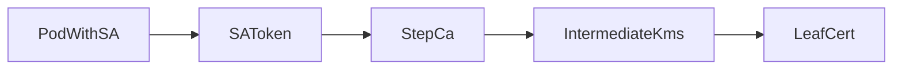

# Leaf service certificate interface

Contract for workloads that need short-lived X.509 certificates from the company Intermediate CA (`step-ca`).

## Audience and scope

**In scope (leaf):**

- Issue a leaf certificate
- Renew / rotate a leaf certificate
- Fetch trust material (Root / chain)
- CA health checks

**Out of scope (operators only):**

- Root CA lifecycle
- Intermediate CA renewal / CSR signing
- AWS KMS / `pki-admin` assume-role
- Helm / Terraform

Workflow diagrams: [../workflows/issue-leaf-certificate.md](../workflows/issue-leaf-certificate.md), [../workflows/renew-leaf-certificate.md](../workflows/renew-leaf-certificate.md).

Policy sketch: [../certificate-policy.md](../certificate-policy.md).

---

## Preferred interface: K8SSA



### Auth

- Use the pod’s projected **Kubernetes ServiceAccount** JWT.
- CA validates the token via the **K8SSA** provisioner (example name: `kube-default` in [`intermediate-ca/config/ca.json.example`](../../intermediate-ca/config/ca.json.example)).
- Do not embed static provisioner passwords in leaf deployments for production.

### Identity policy

```text
namespace + serviceAccount → allowed SAN only
```

Example (conceptual):

```text
namespace: payments
serviceAccount: payments-api
allowed identity: payments-api.payments.svc.cluster.local
```

Details: [`intermediate-ca/provisioners/k8ssa.md`](../../intermediate-ca/provisioners/k8ssa.md).

Arbitrary DNS / unrestricted SA→SAN is **denied**.

### Endpoints (in-cluster)

| Purpose | Example |
|---------|---------|
| CA base URL | `https://step-ca.step-ca.svc.cluster.local` (Service port maps to CA listen port) |
| Health | `GET /health` |
| Trust anchors | `GET /roots.pem` |

Issued leaf responses include the leaf and Intermediate chain material. Mount the **Root** certificate as the trust anchor for peers.

Hostname / service DNS in examples is non-production (`example.internal`, `*.svc.cluster.local`).

### Issue (sign)

1. Ensure the workload SA is allow-listed for the requested SAN.
2. Authenticate with the SA token to the K8SSA provisioner (Smallstep issues a short-lived OTT).
3. Submit a CSR / certificate request for the allowed identity against the CA.

Typical operator/debug path (pod with `step` CLI and SA token):

```bash
# Illustrative — provisioner name and CA URL from your environment
step ca certificate \
  payments-api.payments.svc.cluster.local \
  leaf.crt leaf.key \
  --provisioner kube-default \
  --ca-url https://step-ca.step-ca.svc.cluster.local \
  --root root_ca.crt
```

Libraries and sidecars that speak the Smallstep CA HTTP API are equivalent; see [Smallstep CA documentation](https://smallstep.com/docs/step-ca/).

### Renew / rotate leaf

- Same auth and SAN policy as issue.
- Renew before expiry (e.g. when remaining lifetime approaches your `renewBefore` budget).
- Hot-swap TLS material on the process / sidecar; **no Root** and no Intermediate re-signing.
- TTL bounds (from example CA config; override per env):

| Claim | Example |
|-------|---------|
| Default leaf TTL | `1h` |
| Max leaf TTL (K8SSA) | `8h` |
| Authority max | `24h` |

Do not request durations above provisioner `maxTLSCertDuration`.

### Trust fetch

```bash
curl -fsSk https://step-ca.step-ca.svc.cluster.local/roots.pem -o root_ca.crt
```

Distribute Root as the long-lived trust anchor. Intermediate comes with the leaf bundle after issue/renew.

Local integration tests: [`../../test/README.md`](../../test/README.md) (`make test`).

---

## Optional interface: ACME + cert-manager

For workloads that prefer Kubernetes `Certificate` resources instead of in-process K8SSA clients.

1. ClusterIssuer points at the CA ACME directory, e.g.  
   `https://step-ca.step-ca.svc.cluster.local/acme/acme/directory`  
   ([`integrations/cert-manager/clusterissuer.yaml`](../../integrations/cert-manager/clusterissuer.yaml)).
2. Leaf owns a `Certificate` CR ([`integrations/cert-manager/certificate-examples/example-workload.yaml`](../../integrations/cert-manager/certificate-examples/example-workload.yaml)).
3. cert-manager performs issue and renew; leaf mounts the resulting TLS Secret.

HTTP-01 solver / ingress class remains `REPLACE_ME` until the platform sets it. Core `step-ca` does **not** require cert-manager.

---

## External / non-Kubernetes leaves

Use ACME or an **admin-approved** provisioner. See [`integrations/external-workloads/README.md`](../../integrations/external-workloads/README.md).

Do not give every external service an unrestricted JWK/password provisioner.

---

## Error and denial semantics

| Condition | Leaf behavior |
|-----------|----------------|
| Bad / expired SA token | Fail auth; refresh projected token and retry |
| SAN not allowed for SA | Permanent policy denial until allow-list updated |
| Requested TTL above max | Denial; lower duration |
| CA down / KMS Sign failure | Retry with backoff; **do not** fall back to long-lived self-signed as “production” |

Revocation of a bad leaf is an **operator** action ([../workflows/revoke-certificate.md](../workflows/revoke-certificate.md)). After re-issue, the leaf renews via the normal interface.

---

## Explicit non-interfaces

| Do not use from a leaf | Why |
|------------------------|-----|
| `root-ca/scripts/*`, Root KMS | Offline / admin only |
| Intermediate CSR + Root sign | Operator Intermediate renewal |
| `pki-admin` / static AWS keys in the pod | Breaks least privilege |
| Unrestricted password / JWK provisioners in prod | Identity bypass |
| Long-lived self-signed “until CA is back” as prod TLS | Trust model violation |
