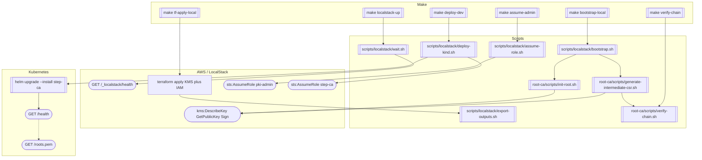
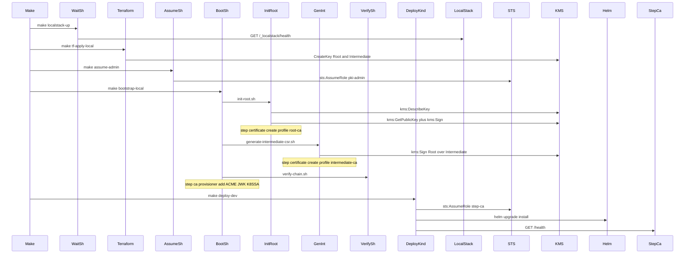

# Workflow: Bootstrap PKI

First-time (or rebuilt) environment: create KMS/IAM, offline Root, Intermediate, deploy online `step-ca`, verify.

Runbook: [../runbooks/bootstrap.md](../runbooks/bootstrap.md)

Local path is fully scripted (`Makefile`). Production uses the same Root scripts + Terraform/Helm, not a `make deploy` target.

| Make | Script | APIs |
|------|--------|------|
| `localstack-up` | `scripts/localstack/wait.sh` | `GET /_localstack/health` |
| `tf-apply-local` | `scripts/localstack/export-outputs.sh` | Terraform → `kms:CreateKey`, IAM roles |
| `assume-admin` | `scripts/localstack/assume-role.sh` | `sts:AssumeRole` (`pki-admin`) |
| `bootstrap-local` | `scripts/localstack/bootstrap.sh` → `init-root.sh`, `generate-intermediate-csr.sh`, `verify-chain.sh` | `kms:DescribeKey`, `kms:GetPublicKey`, `kms:Sign` |
| `deploy-dev` | `scripts/localstack/deploy-kind.sh` | `sts:AssumeRole` (`step-ca`), Helm, `GET /health` |
| `verify-chain` | `scripts/verify-chain.sh` → `root-ca/scripts/verify-chain.sh` | local OpenSSL chain check |

`root-ca/scripts/sign-intermediate.sh` is a stub; signing is `generate-intermediate-csr.sh`.

Root CA stays on the admin path only — never a Kubernetes Deployment.
