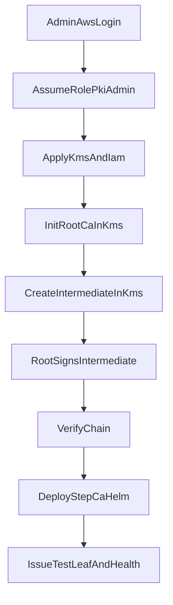

# Workflow: Bootstrap PKI

First-time (or rebuilt) environment: create KMS/IAM, offline Root, Intermediate, deploy online `step-ca`, verify.

Runbook: [../runbooks/bootstrap.md](../runbooks/bootstrap.md)

Root CA stays on the admin path only — never a Kubernetes Deployment.
