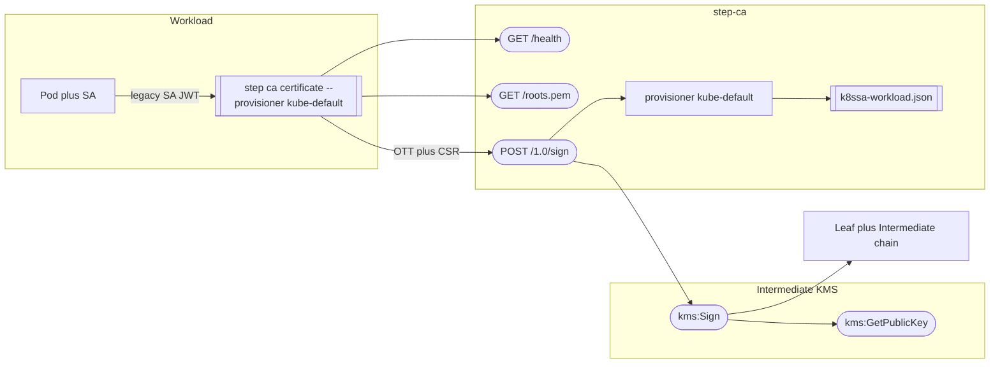
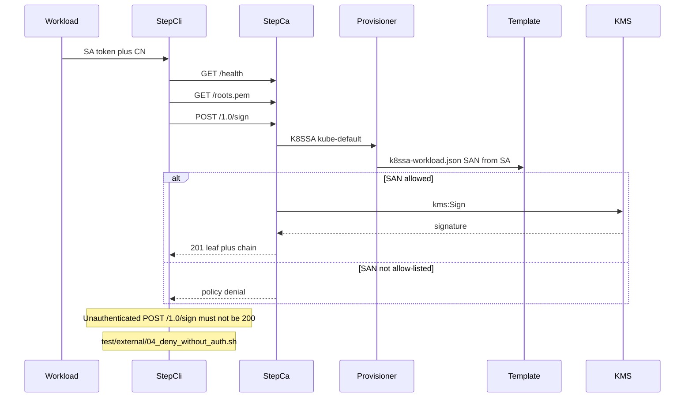
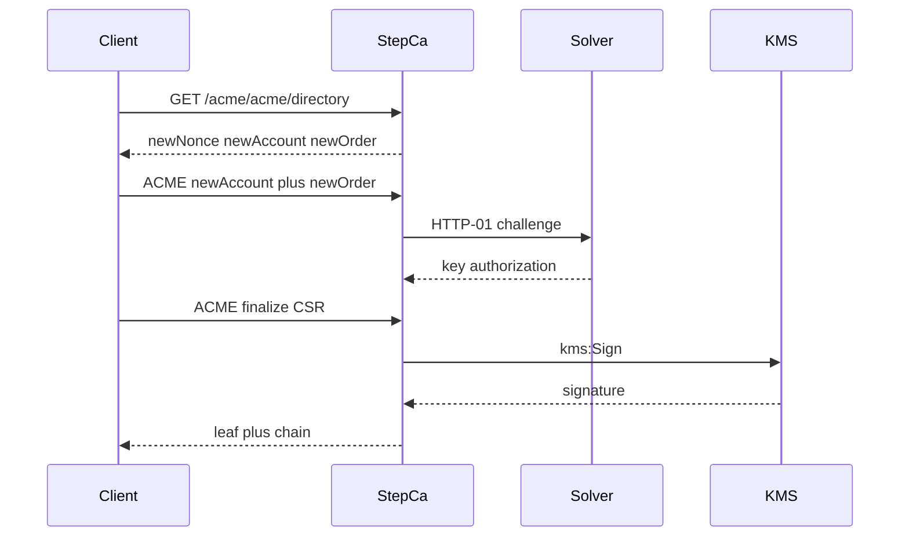

# Workflow: Issue leaf certificate

Online path only. Workload authenticates to `step-ca` (K8SSA or ACME); Intermediate private key signs via KMS. Root stays offline.

Related: [../certificate-policy.md](../certificate-policy.md), provisioner notes under `intermediate-ca/provisioners/`.

Preferred path (K8SSA). Client: `step ca certificate --provisioner kube-default` (or any Smallstep HTTP client). Tests: `test/k8ssa/02_issue_allowed_san.sh`, deny: `test/k8ssa/03_deny_arbitrary_san.sh`.

Optional ACME (cert-manager or `step ca certificate --acme`). ClusterIssuer: `integrations/cert-manager/clusterissuer.yaml`. Test: `test/external/02_acme_issue.sh`.

| Client | Script / test | APIs |
|--------|---------------|------|
| K8SSA workload | `step ca certificate --provisioner kube-default --k8ssa-token-path …` | `GET /health`, `GET /roots.pem`, `POST /1.0/sign` → `kms:Sign` |
| ACME / cert-manager | `step ca certificate --acme …/acme/acme/directory` | `GET /acme/acme/directory`, ACME newNonce / newAccount / newOrder / finalize → `kms:Sign` |
| External JWK (dev) | `test/external/03_jwk_issue_and_renew.sh` | `POST /1.0/sign` with JWK provisioner `external-test` |
| Health / trust | `intermediate-ca/scripts/healthcheck.sh`, `test/k8ssa/01_health_and_roots.sh` | `GET /health`, `GET /roots.pem` |

In-cluster base URL: `https://step-ca.step-ca.svc.cluster.local` (Service `:443` → CA `:9000`).

Do not allow unrestricted SA → arbitrary SAN mappings.

Interface contract: [../interfaces/leaf-service.md](../interfaces/leaf-service.md).
