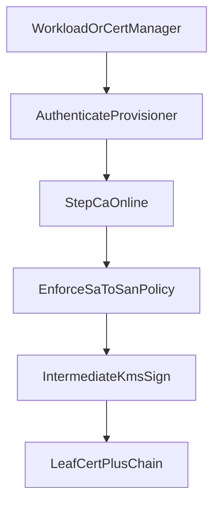

# Workflow: Issue leaf certificate

Online path only. Workload authenticates to `step-ca` (K8SSA or ACME); Intermediate private key signs via KMS. Root stays offline.

Related: [../certificate-policy.md](../certificate-policy.md), provisioner notes under `intermediate-ca/provisioners/`.

Do not allow unrestricted SA → arbitrary SAN mappings.

Interface contract: [../interfaces/leaf-service.md](../interfaces/leaf-service.md).
