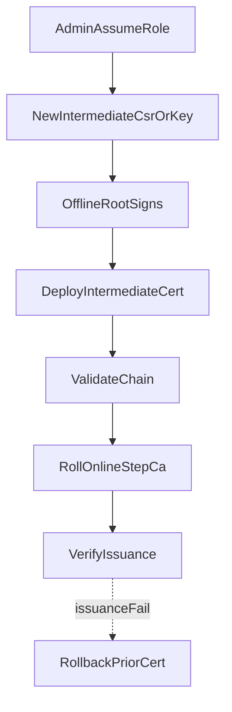

# Workflow: Renew Intermediate CA

Admin-machine operation. New Intermediate material (often new KMS key + CSR); offline Root signs; online CA rolls to the new cert. Never depends on an online Root.

Runbook: [../runbooks/intermediate-renewal.md](../runbooks/intermediate-renewal.md)

Keep the prior Intermediate certificate available until issuance is proven healthy.
