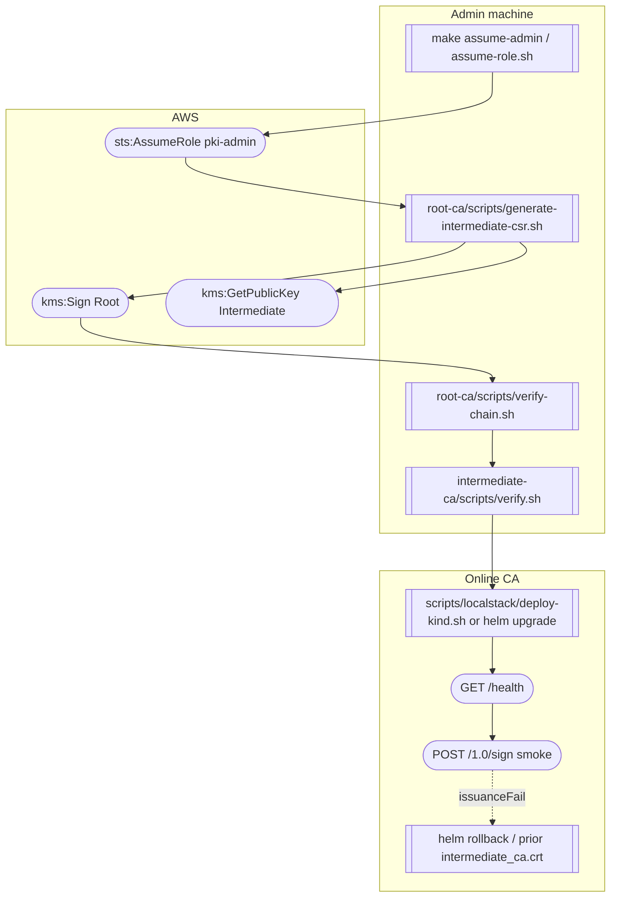
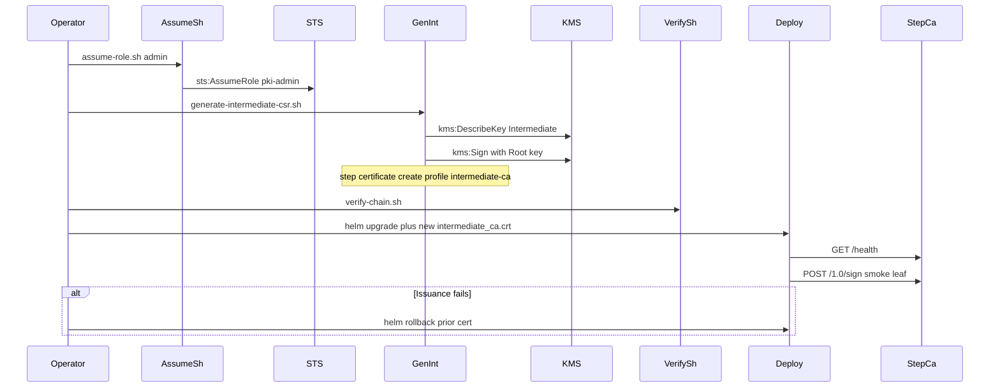

# Workflow: Renew Intermediate CA

Admin-machine operation. New Intermediate material (often new KMS key + CSR); offline Root signs; online CA rolls to the new cert. Never depends on an online Root.

Runbook: [../runbooks/intermediate-renewal.md](../runbooks/intermediate-renewal.md)

| Step | Script | APIs |
|------|--------|------|
| Identity | `scripts/localstack/assume-role.sh` (`make assume-admin`) | `sts:AssumeRole` (`pki-admin`) |
| New Intermediate | `root-ca/scripts/generate-intermediate-csr.sh` | `kms:DescribeKey`, `kms:GetPublicKey`, `kms:Sign` (Root) |
| Chain check | `root-ca/scripts/verify-chain.sh`, `intermediate-ca/scripts/verify.sh` | OpenSSL `verify -CAfile` |
| Roll online CA | `scripts/localstack/deploy-kind.sh` or Helm | Kubernetes apply |
| Prove issuance | `intermediate-ca/scripts/healthcheck.sh`, `step ca certificate` | `GET /health`, `POST /1.0/sign` → Intermediate `kms:Sign` |

`root-ca/scripts/sign-intermediate.sh` is a stub pointer at this runbook; do not use it as the signing path.

Keep the prior Intermediate certificate available until issuance is proven healthy.
