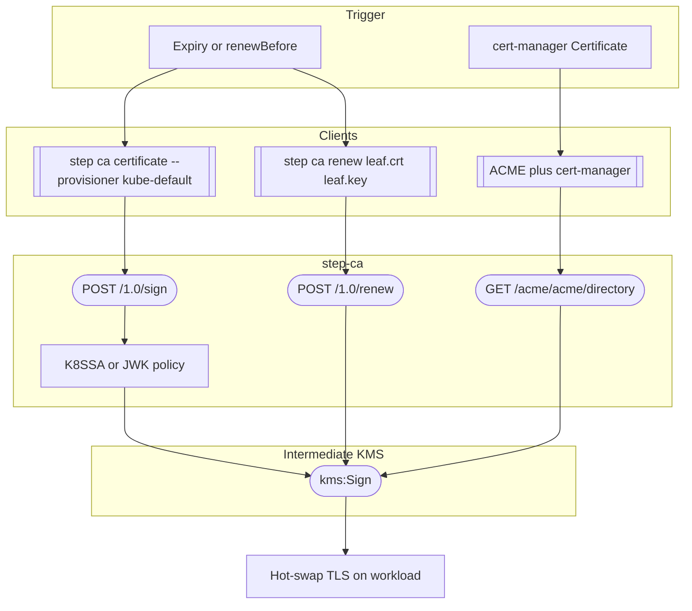
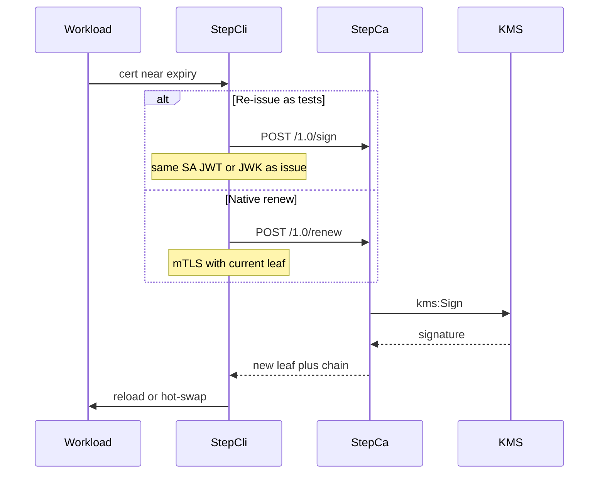

# Workflow: Renew leaf certificate

Short-lived leaves renew without Root or Intermediate re-signing. Same provisioner auth as issue; swap cert on the workload.

Related: [issue-leaf-certificate.md](issue-leaf-certificate.md)

Two equivalent online paths (neither uses `pki-admin` or Root KMS):

1. **Re-issue** — `step ca certificate` again → `POST /1.0/sign` (what `test/k8ssa/04_renew_leaf.sh` and `test/external/03_jwk_issue_and_renew.sh` do).
2. **mTLS renew** — `step ca renew` → `POST /1.0/renew` with the current leaf.

| Client | Script / test | APIs |
|--------|---------------|------|
| K8SSA re-issue | `test/k8ssa/04_renew_leaf.sh` → `step ca certificate --provisioner kube-default` | `POST /1.0/sign` → `kms:Sign` |
| JWK re-issue | `test/external/03_jwk_issue_and_renew.sh` | `POST /1.0/sign` |
| Native renew | `step ca renew` | `POST /1.0/renew` → `kms:Sign` |
| ACME | cert-manager or `step ca certificate --acme` | `GET /acme/acme/directory` + ACME order finalize |

TTL bounds (example `ca.json`): default leaf `1h`, K8SSA max `8h`, authority max `24h`. Do not request above provisioner `maxTLSCertDuration`.

No admin assume-role and no Root involvement for routine leaf renewal.

Interface contract: [../interfaces/leaf-service.md](../interfaces/leaf-service.md).
