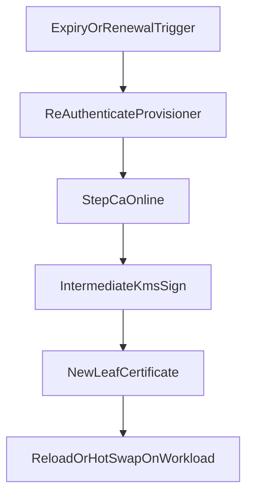

# Workflow: Renew leaf certificate

Short-lived leaves renew without Root or Intermediate re-signing. Same provisioner auth as issue; swap cert on the workload.

Related: [issue-leaf-certificate.md](issue-leaf-certificate.md)

No admin assume-role and no Root involvement for routine leaf renewal.

Interface contract: [../interfaces/leaf-service.md](../interfaces/leaf-service.md).
