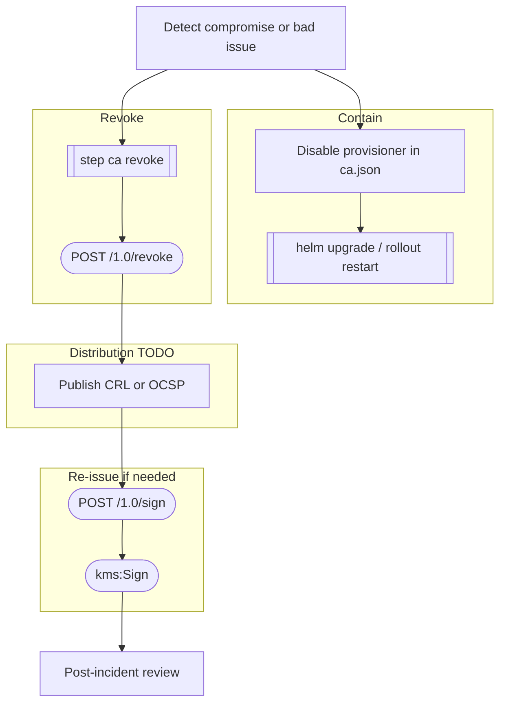
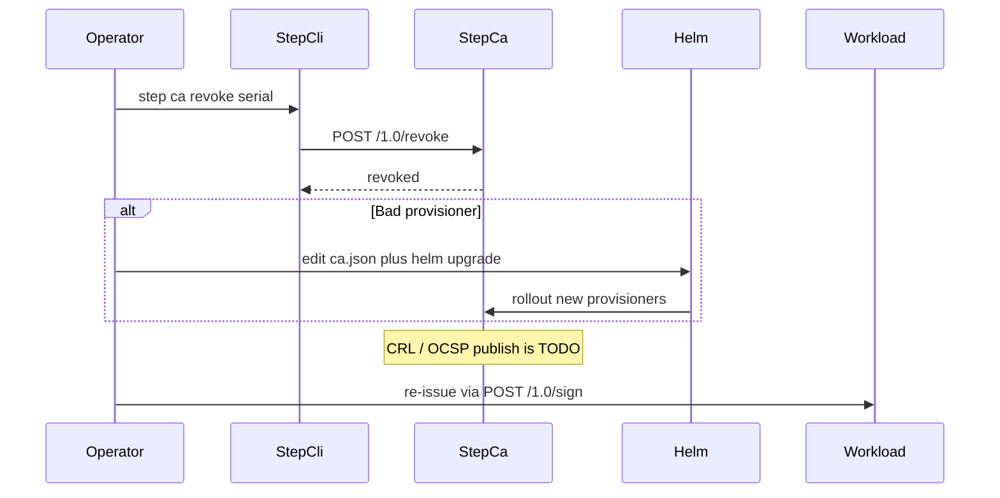

# Workflow: Revoke certificate

Contain compromised or wrongly issued leaves (or disable a bad provisioner). Exact CRL/OCSP distribution is org-specific — treat those nodes as TODO until product choice is fixed.

Related: [../runbooks/incident-response.md](../runbooks/incident-response.md)

Operator action (not a leaf self-service). After revoke, re-issue via [issue-leaf-certificate.md](issue-leaf-certificate.md).

| Action | Script / command | APIs |
|--------|------------------|------|
| Revoke leaf | `step ca revoke` | `POST /1.0/revoke` |
| Disable issuance | edit `local/config/ca.json` or ConfigMap; `helm upgrade` / `scripts/localstack/deploy-kind.sh` | Kubernetes apply; CA reload |
| Confirm CA up | `intermediate-ca/scripts/healthcheck.sh` | `GET /health` |
| Re-issue | `step ca certificate` | `POST /1.0/sign` → `kms:Sign` |
| CRL / OCSP | none in-repo | TODO |

If Intermediate or Root is compromised, escalate to [renew-intermediate-ca.md](renew-intermediate-ca.md) or [rotate-root-ca.md](rotate-root-ca.md) — leaf revoke alone is insufficient.
