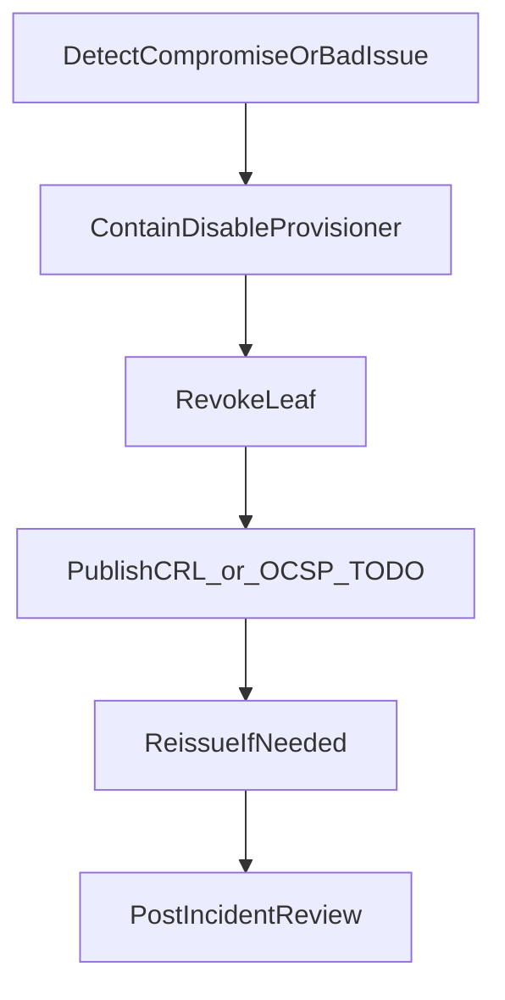

# Workflow: Revoke certificate

Contain compromised or wrongly issued leaves (or disable a bad provisioner). Exact CRL/OCSP distribution is org-specific — treat those nodes as TODO until product choice is fixed.

Related: [../runbooks/incident-response.md](../runbooks/incident-response.md)

If Intermediate or Root is compromised, escalate to [renew-intermediate-ca.md](renew-intermediate-ca.md) or [rotate-root-ca.md](rotate-root-ca.md) — leaf revoke alone is insufficient.
