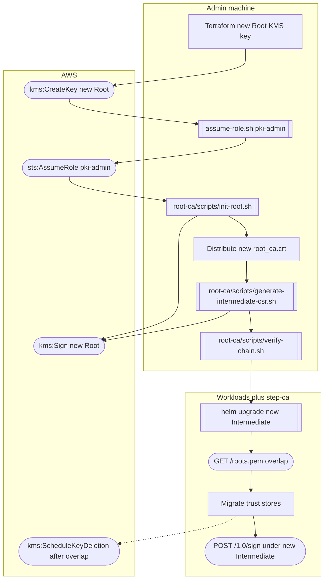
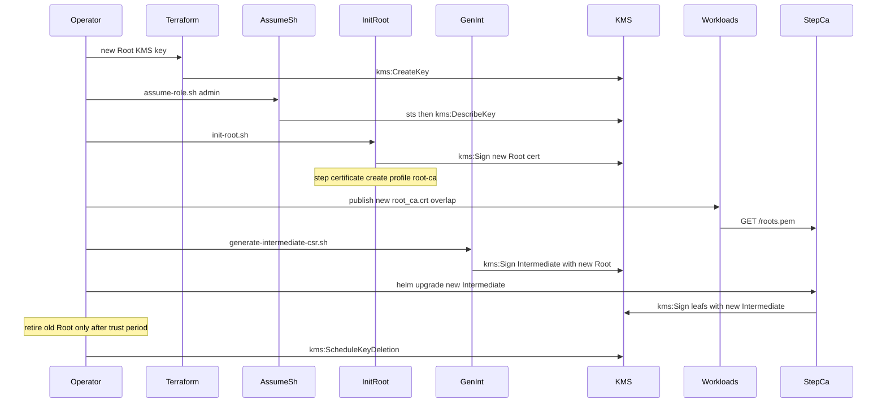

# Workflow: Rotate Root CA

Manual security operation — not automated. Publish new trust anchor with overlap; create and deploy a new Intermediate under the new Root; retire old Root only after the required trust period.

Runbook: [../runbooks/root-rotation.md](../runbooks/root-rotation.md)

| Step | Script | APIs |
|------|--------|------|
| New Root key | Terraform (`infrastructure/aws`) | `kms:CreateKey`, `kms:CreateAlias` |
| Identity | `scripts/localstack/assume-role.sh` | `sts:AssumeRole` (`pki-admin`) |
| New Root cert | `root-ca/scripts/init-root.sh` | `kms:DescribeKey`, `kms:GetPublicKey`, `kms:Sign` |
| Trust overlap | distribute `root_ca.crt`; workloads may `curl` | `GET /roots.pem` |
| New Intermediate | `root-ca/scripts/generate-intermediate-csr.sh` | Root `kms:Sign` |
| Deploy | Helm / `scripts/localstack/deploy-kind.sh` | `GET /health`, `POST /1.0/sign` |
| Retire old Root | after overlap | `kms:ScheduleKeyDeletion` |

Do not reuse a compromised Root KMS key. `pki-admin` signs Root; the `step-ca` role never gets Root KMS.
