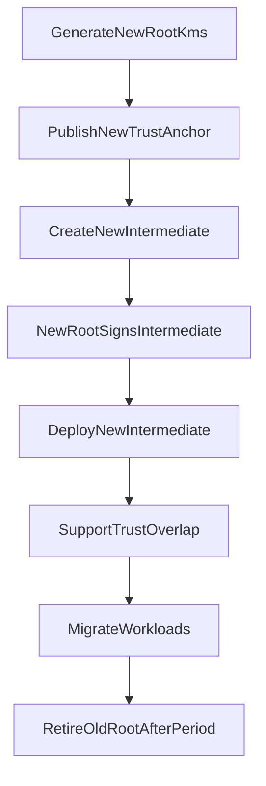

# Workflow: Rotate Root CA

Manual security operation — not automated. Publish new trust anchor with overlap; create and deploy a new Intermediate under the new Root; retire old Root only after the required trust period.

Runbook: [../runbooks/root-rotation.md](../runbooks/root-rotation.md)

Do not reuse a compromised Root KMS key.
